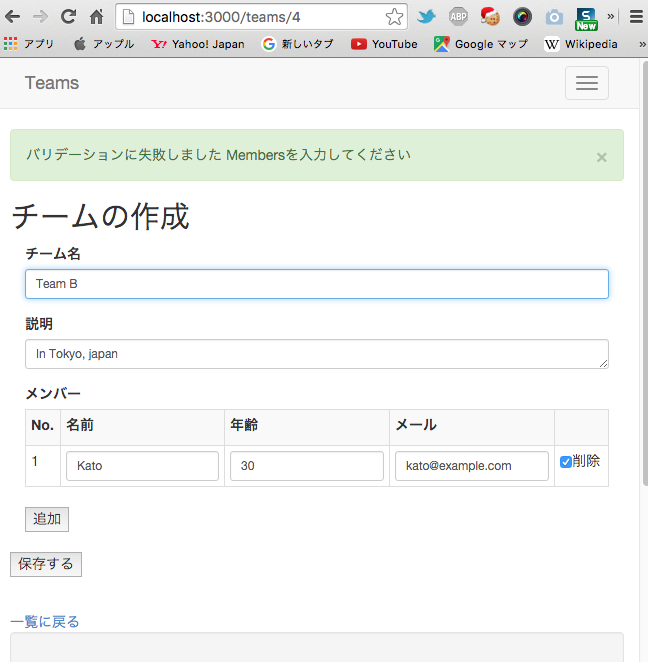

[](https://travis-ci.org/katoy/rails4-teams)
[](https://gemnasium.com/katoy/rails4-teams)


準備
=====
    $ rails new teams -t
    $ cd teams
Gemfile を編集して、幾つかの gem を追加する。

その後 gem のインストール、model の作成を行う。

    $ bundle install
    $ rails g model team
    $ rails g model member
    $ rails g model staff
    $ rails g model developer
    $ rails g model person

db/migrates 以下を編集して team, member, staff, developer, person の DB 構造を記載する。

person の複数形は people であることに注意する ( "person".pluralize => "people")

１対ｎの関係も db/migrate/*, app/models/* で設定する。

また、  
　　チームは必ず１人以上のメンバーが属している事  
を validator で設定する。  

db/seed.rb で次の関係のデータを設定する。

    Team A ---- Abe
            |-- Inoue

    Team B ---- Kato

次のようにして、DB の初期化とデータ内容をチェックする。

    $ bundle exec rake db:drop
    $ bundle exec rake db:reset
    $ rails c
    [1] pry(main)> Team.all
    Team Load (3.0ms)  SELECT "teams".* FROM "teams"  ORDER BY "teams"."name" ASC
    +----+--------+-----------------+-------------------------+-------------------------+
    | id | name   | description     | created_at              | updated_at              |
    +----+--------+-----------------+-------------------------+-------------------------+
    | 1  | Team A | In China        | 2015-12-20 03:53:36 UTC | 2015-12-20 03:53:36 UTC |
    | 2  | Team B | In Tokyo, japan | 2015-12-20 03:53:36 UTC | 2015-12-20 03:53:36 UTC |
    +----+--------+-----------------+-------------------------+-------------------------+
    2 rows in set

    [2] pry(main)> Member.all
    Member Load (0.2ms)  SELECT "members".* FROM "members"  ORDER BY "members"."created_at" ASC
    +----+-------------+-----------+---------+-------------------------+-------------------------+
    | id | target_type | target_id | team_id | created_at              | updated_at              |
    +----+-------------+-----------+---------+-------------------------+-------------------------+
    | 1  | Staff       | 1         | 1       | 2015-12-20 03:53:36 UTC | 2015-12-20 03:53:36 UTC |
    | 2  | Developer   | 1         | 1       | 2015-12-20 03:53:36 UTC | 2015-12-20 03:53:36 UTC |
    | 3  | Staff       | 1         | 2       | 2015-12-20 03:53:36 UTC | 2015-12-20 03:53:36 UTC |
    | 4  | Staff       | 2         | 2       | 2015-12-20 03:53:36 UTC | 2015-12-20 03:53:36 UTC |
    | 5  | Developer   | 1         | 2       | 2015-12-20 03:53:36 UTC | 2015-12-20 03:53:36 UTC |
    | 6  | Developer   | 2         | 2       | 2015-12-20 03:53:36 UTC | 2015-12-20 03:53:36 UTC |
    +----+-------------+-----------+---------+-------------------------+-------------------------+
    6 rows in set

    [3] pry(main)> Person.all
    Person Load (0.2ms)  SELECT "people".* FROM "people"  ORDER BY "people"."created_at" ASC
    +----+-------+-----+-------------------+-------------------------+-------------------------+
    | id | name  | age | mail              | created_at              | updated_at              |
    +----+-------+-----+-------------------+-------------------------+-------------------------+
    | 1  | Abe   | 30  | abe@example.com   | 2015-12-20 03:53:35 UTC | 2015-12-20 03:53:35 UTC |
    | 2  | Inoue | 40  | inoue@example.com | 2015-12-20 03:53:35 UTC | 2015-12-20 03:53:35 UTC |
    | 3  | Matu  | 30  | matu@example.com  | 2015-12-20 03:53:35 UTC | 2015-12-20 03:53:35 UTC |
    | 4  | Duku  | 30  | duku@example.com  | 2015-12-20 03:53:35 UTC | 2015-12-20 03:53:35 UTC |
    +----+-------+-----+-------------------+-------------------------+-------------------------+
    4 rows in set

    [4] pry(main)> Jobkind.all
    Jobkind Load (0.2ms)  SELECT "jobkinds".* FROM "jobkinds"  ORDER BY "jobkinds"."created_at" ASC
    +----+------------------+----------------+-----------+-------------------------+-------------------------+
    | id | jobkindable_type | jobkindable_id | person_id | created_at              | updated_at              |
    +----+------------------+----------------+-----------+-------------------------+-------------------------+
    | 1  | Staff            | 1              | 1         | 2015-12-20 03:53:36 UTC | 2015-12-20 03:53:36 UTC |
    | 2  | Staff            | 2              | 2         | 2015-12-20 03:53:36 UTC | 2015-12-20 03:53:36 UTC |
    | 3  | Developer        | 1              | 3         | 2015-12-20 03:53:36 UTC | 2015-12-20 03:53:36 UTC |
    | 4  | Developer        | 2              | 4         | 2015-12-20 03:53:36 UTC | 2015-12-20 03:53:36 UTC |
    +----+------------------+----------------+-----------+-------------------------+-------------------------+
    4 rows in set

    [5] pry(main)> Staff.all
    Staff Load (0.2ms)  SELECT "staffs".* FROM "staffs"
    +----+----------+-------------------------+-------------------------+
    | id | skill    | created_at              | updated_at              |
    +----+----------+-------------------------+-------------------------+
    | 1  | 経理     | 2015-12-20 03:53:35 UTC | 2015-12-20 03:53:35 UTC |
    | 2  | 事務処理 | 2015-12-20 03:53:36 UTC | 2015-12-20 03:53:36 UTC |
    +----+----------+-------------------------+-------------------------+

    [6] pry(main)> Developer.all
    Developer Load (0.3ms)  SELECT "developers".* FROM "developers"
    +----+------+-------------------------+-------------------------+
    | id | lang | created_at              | updated_at              |
    +----+------+-------------------------+-------------------------+
    | 1  | ruby | 2015-12-20 03:53:36 UTC | 2015-12-20 03:53:36 UTC |
    | 2  | java | 2015-12-20 03:53:36 UTC | 2015-12-20 03:53:36 UTC |
    +----+------+-------------------------+-------------------------+
    2 rows in set


ER図を生成する。

    $ bundle exec rake erd
    Loading code in search of Active Record models...
    Generating Entity-Relationship Diagram for 2 models...
    Done! Saved diagram to erd.pdf.


Form の作成
===========

app/controllers/teams_contloler.rb を作成する。

views/* を作成する。

app/assets/javascripts/teams.coffee を作成する。

チームを編集する際には、次のようなparamsがコントローラに渡ってくる。

```json
{"utf8"=>"✓",
 "_method"=>"patch",
 "authenticity_token"=>"tKW3fTDfPhvhYWr6Fke/SnxBD29d8ql6oNRtZoTFQIR3FvzK7FSL4f/lpbKh5mfxRtiPSDAxQpyq8rgYR3xi6A==",
 "team"=>
  {"name"=>"Team A",
   "description"=>"In China",
   "members_attributes"=>
    {"0"=>{"name"=>"Abe", "age"=>"30", "mail"=>"abe@example.com", "_destroy"=>"1", "id"=>"1"},
     "1"=>{"name"=>"Inoue", "age"=>"40", "mail"=>"inoue@example.com", "_destroy"=>"1", "id"=>"2"},
     "2"=>{"name"=>"zzz", "age"=>"33", "mail"=>"33@com", "_destroy"=>"0", "id"=>"4"},
     "3"=>{"name"=>"yyy", "age"=>"22", "mail"=>"22@com"}}},
 "commit"=>"保存する",
 "controller"=>"teams",
 "action"=>"update",
 "id"=>"1"}
```

削除するメンバーは _destroy => 1 となる。

既存のメンバーの編集なら、 id => ”４” のように member の id が設定される。

新規のメンバーは、id は設定されていない。


# スクリーンショット

* 001 
* 002 
* 003 


# REST API の作成

## url

http://localhost:3000/api/v1/teams (GET)

http://localhost:3000/api/v1/people (GET)


## コンソールでJbuilderの動作を確認

````````````````
$ rails

> @teams = Team.all
> str = Jbuilder.encode do |json|
    json.array!(@teams) do |team|
    json.name team.name
      json.id team.id
    end
  end
> jj JSON.parse(str)
[
  {
    "name": "Team A",
    "id": 1
  },
  {
    "name": "Team B",
    "id": 2
  }
]
``````````````````

コンソールでは jjson.partial! がなぜか動作しない。  
次のようにして確認できる。
``````````````````
> view = ApplicationController.view_context_class.new("#{Rails.root}/app/views");''
> jj JbuilderTemplate.new(view).encode { |json| json.partial! 'api/v1/shared/team', team: @teams[0] }
{
  "team": {
    "id": 1,
    "name": "Team A",
    "members": [
      {
        "staff": {
          "id": 1,
          "skill": "経理",
          "jobkind": {
            "id": 1,
            "person": {
              "id": 1,
              "name": "Abe",
              "age": 30,
              "mail": "abe@example.com"
            }
          }
        }
      },
      {
        "developer": {
          "id": 1,
          "lang": "ruby",
          "jobkind": {
            "id": 3,
            "person": {
              "id": 3,
              "name": "Matu",
              "age": 30,
              "mail": "matu@example.com"
            }
          }
        }
      }
    ]
  }
}
``````````````````

``````````````````
> builder = JbuilderTemplate.new(ApplicationController.new.view_context)
> builder.partial!("api/v1/shared/team.json.jbuilder", team: @teams[0])
> str = builder.target!
> jj JSON.parse(str)
{
  "respond_to?": "to_a",
  "is_a?": {
  },
  "team": {
    "id": 1,
    "name": "Team A",
    "members": [
      {
        "staff": {
          "id": 1,
          "skill": "経理",
          "jobkind": {
            "id": 1,
            "person": {
              "id": 1,
              "name": "Abe",
              "age": 30,
              "mail": "abe@example.com"
            }
          }
        }
      },
      {
        "developer": {
          "id": 1,
          "lang": "ruby",
          "jobkind": {
            "id": 3,
            "person": {
              "id": 3,
              "name": "Matu",
              "age": 30,
              "mail": "matu@example.com"
            }
          }
        }
      }
    ]
  }
}
``````````````````

## 検索

People から Staff を検索する
``````````````````
> Person.joins(:jobkinds).where("jobkinds.jobkindable_type =?", "Staff")
  Person Load (0.2ms)  SELECT "people".* FROM "people" INNER JOIN "jobkinds" ON "jobkinds"."person_id" = "people"."id" WHERE (jobkinds.jobkindable_type ='Staff')  ORDER BY "people"."created_at" ASC
+----+-------+-----+-------------------+-------------------------+-------------------------+
| id | name  | age | mail              | created_at              | updated_at              |
+----+-------+-----+-------------------+-------------------------+-------------------------+
| 1  | Abe   | 30  | abe@example.com   | 2015-12-20 07:54:27 UTC | 2015-12-20 07:54:27 UTC |
| 2  | Inoue | 40  | inoue@example.com | 2015-12-20 07:54:27 UTC | 2015-12-20 07:54:27 UTC |
+----+-------+-----+-------------------+-------------------------+-------------------------+
``````````````````

Person の Jobkind を列挙する
時間がかかる方法
``````````````````
> people = Person.all
  Person Load (0.3ms)  SELECT "people".* FROM "people"  ORDER BY "people"."created_at" ASC

> people.each {|person| p person.jobkinds}
Jobkind Load (23.2ms)  SELECT "jobkinds".* FROM "jobkinds" WHERE "jobkinds"."person_id" = ?  ORDER BY "jobkinds"."created_at" ASC  [["person_id", 1]]
#<ActiveRecord::Associations::CollectionProxy [#<Jobkind id: 1, jobkindable_type: "Staff", jobkindable_id: 1, person_id: 1, created_at: "2015-12-20 07:54:27", updated_at: "2015-12-20 07:54:27">]>
Jobkind Load (0.1ms)  SELECT "jobkinds".* FROM "jobkinds" WHERE "jobkinds"."person_id" = ?  ORDER BY "jobkinds"."created_at" ASC  [["person_id", 2]]
#<ActiveRecord::Associations::CollectionProxy [#<Jobkind id: 2, jobkindable_type: "Staff", jobkindable_id: 2, person_id: 2, created_at: "2015-12-20 07:54:27", updated_at: "2015-12-20 07:54:27">]>
Jobkind Load (0.2ms)  SELECT "jobkinds".* FROM "jobkinds" WHERE "jobkinds"."person_id" = ?  ORDER BY "jobkinds"."created_at" ASC  [["person_id", 3]]
#<ActiveRecord::Associations::CollectionProxy [#<Jobkind id: 3, jobkindable_type: "Developer", jobkindable_id: 1, person_id: 3, created_at: "2015-12-20 07:54:27", updated_at: "2015-12-20 07:54:27">]>
Jobkind Load (0.1ms)  SELECT "jobkinds".* FROM "jobkinds" WHERE "jobkinds"."person_id" = ?  ORDER BY "jobkinds"."created_at" ASC  [["person_id", 4]]
#<ActiveRecord::Associations::CollectionProxy [#<Jobkind id: 4, jobkindable_type: "Developer", jobkindable_id: 2, person_id: 4, created_at: "2015-12-20 07:54:28", updated_at: "2015-12-20 07:54:28">]>
``````````````````

改善した方法
``````````````````
> people = Person.all.includes(:jobkinds)
Person Load (31.2ms)  SELECT "people".* FROM "people"  ORDER BY "people"."created_at" ASC
Jobkind Load (0.6ms)  SELECT "jobkinds".* FROM "jobkinds" WHERE "jobkinds"."person_id" IN (1, 2, 3, 4)  ORDER BY "jobkinds"."created_at" ASC

> people.each {|person| p person.jobkinds}
( この実行時は SQLは発行されずに処理される)
``````````````````

``````````````````
> people = Person.joins(:jobkinds).where("jobkinds.jobkindable_type = ?", "Staff")
  Person Load (0.2ms)  SELECT "people".* FROM "people" INNER JOIN "jobkinds" ON "jobkinds"."person_id" = "people"."id" WHERE (jobkinds.jobkindable_type = 'Staff')  ORDER BY "people"."created_at" ASC

> people = Person.includes(:jobkinds).references(:jobkinds).where("jobkinds.jobkindable_type = ?", "Staff")
  SQL (0.5ms)  SELECT "people"."id" AS t0_r0, "people"."name" AS t0_r1, "people"."age" AS t0_r2, "people"."mail" AS t0_r3, "people"."created_at" AS t0_r4, "people"."updated_at" AS t0_r5, "jobkinds"."id" AS t1_r0, "jobkinds"."jobkindable_type" AS t1_r1, "jobkinds"."jobkindable_id" AS t1_r2, "jobkinds"."person_id" AS t1_r3, "jobkinds"."created_at" AS t1_r4, "jobkinds"."updated_at" AS t1_r5 FROM "people" LEFT OUTER JOIN "jobkinds" ON "jobkinds"."person_id" = "people"."id" WHERE (jobkinds.jobkindable_type = 'Staff')  ORDER BY "people"."created_at" ASC
``````````````````

See
===
* http://qiita.com/shizuma/items/6f56ca442111ece021b5
Rails ネストした関連先のテーブルもまとめて保存する (accepts_nested_attributes_for、fields_for)
* http://qiita.com/shizuma/items/5bfcf6c1e855b959e135
Rails 複数の子レコードの作成・更新を自在に扱う (accepts_nested_attributes_for)
* https://www.tamurasouko.com/?p=1595
Rails – 親子テーブルを一度に更新する方法
* http://ruby-rails.hatenadiary.com/entry/20141208/1418018874
Railsでaccepts_nested_attributes_forとfields_forを使ってhas_many関連の子レコードを作成/更新するフォームを作成
* http://ruby-rails.hatenadiary.com/entry/20141207/1417926599
Rails4でポリモフィックのリレーションを実装する
