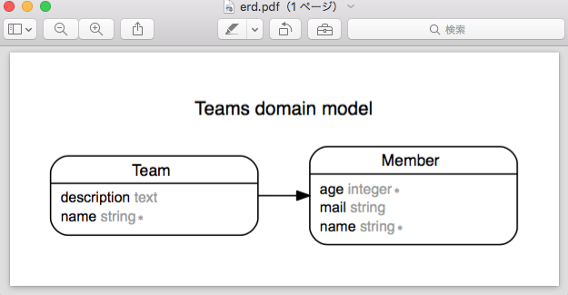
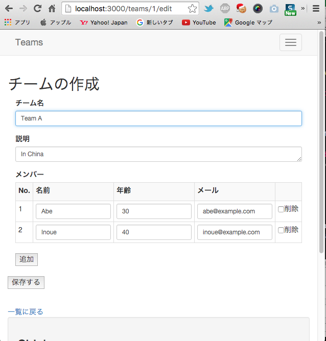
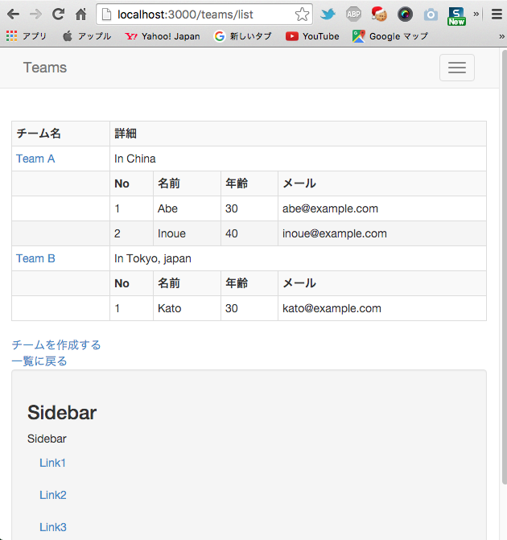

準備
=====
    $ rails new teams -t
    $ cd teams
Gemfile を編集して、幾つかの gem を追加する。

その後 gem のインストール、model の作成を行う。

    $ bundle install
    $ rails g model team
    $ rails g model member

db/migrates 以下を編集して team, member の DB 構造を記載する。

team 1: <-> n: member の１対ｎの関係も db/migrate/*, app/models/* で設定する。

また、  
　　チームは必ず１人以上のメンバーが属している事  
を validator で設定する。  

db/seed.rb で次の関係のデータを設定する。

    Team A ---- Abe
            |-- Inoue

    Team B ---- Kato

次のようにして、DB の初期化とデータ内容をチェックする。

    $ bundle exec rake db:drop
    $ bundle exec rake db:reset
    $ rails c
    [1] pry(main)>
    [2] pry(main)> Team.all
    Team Load (2.2ms)  SELECT "teams".* FROM "teams"
    +----+--------+-------------+-------------------------+-------------------------+
    | id | name   | description | created_at              | updated_at              |
    +----+--------+-------------+-------------------------+-------------------------+
    | 1  | Team A |             | 2015-12-12 00:08:41 UTC | 2015-12-12 00:08:41 UTC |
    | 2  | Team B |             | 2015-12-12 00:08:41 UTC | 2015-12-12 00:08:41 UTC |
    +----+--------+-------------+-------------------------+-------------------------+
    2 rows in set

    [3] pry(main)> Member.all
    Member Load (0.2ms)  SELECT "members".* FROM "members"
    +----+------+-----+-------------------+---------+-------------------------+-------------------------+
    | id | name | age | mail              | team_id | created_at              | updated_at              |
    +----+-------+-----+-------------------+---------+-------------------------+-------------------------+
    | 1  | Abe   | 30  | abe@example.com   | 1       | 2015-12-12 00:08:41 UTC | 2015-12-12 00:08:41 UTC |
    | 2  | Inoue | 40  | inoue@example.com | 1       | 2015-12-12 00:08:41 UTC | 2015-12-12 00:08:41 UTC |
    | 3  | Kato  | 30  | kato@example.com  | 2       | 2015-12-12 00:08:41 UTC | 2015-12-12 00:08:41 UTC |
    +----+-------+-----+-------------------+---------+-------------------------+-------------------------+
    3 rows in set

    [4] pry(main)> Team.find(1).members
    Team Load (0.2ms)  SELECT  "teams".* FROM "teams" WHERE "teams"."id" = ? LIMIT 1  [["id", 1]]
    Member Load (0.2ms)  SELECT "members".* FROM "members" WHERE "members"."team_id" = ?  [["team_id", 1]]
    +----+-------+-----+-------------------+---------+-------------------------+-------------------------+
    | id | name  | age | mail              | team_id | created_at              | updated_at              |
    +----+-------+-----+-------------------+---------+-------------------------+-------------------------+
    | 1  | Abe   | 30  | abe@example.com   | 1       | 2015-12-12 00:08:41 UTC | 2015-12-12 00:08:41 UTC |
    | 2  | Inoue | 40  | inoue@example.com | 1       | 2015-12-12 00:08:41 UTC | 2015-12-12 00:08:41 UTC |
    +----+-------+-----+-------------------+---------+-------------------------+-------------------------+
    2 rows in set

    [5] pry(main)> Team.find(2).members
    Team Load (0.1ms)  SELECT  "teams".* FROM "teams" WHERE "teams"."id" = ? LIMIT 1  [["id", 2]]
    Member Load (0.1ms)  SELECT "members".* FROM "members" WHERE "members"."team_id" = ?  [["team_id", 2]]
    +----+------+-----+------------------+---------+-------------------------+-------------------------+
    | id | name | age | mail             | team_id | created_at              | updated_at              |
    +----+------+-----+------------------+---------+-------------------------+-------------------------+
    | 3  | Kato | 30  | kato@example.com | 2       | 2015-12-12 00:08:41 UTC | 2015-12-12 00:08:41 UTC |
    +----+------+-----+------------------+---------+-------------------------+-------------------------+
    1 row in set
    [6] pry(main)>

ER図を生成する。

    $ bundle exec rake erd
    Loading code in search of Active Record models...
    Generating Entity-Relationship Diagram for 2 models...
    Done! Saved diagram to erd.pdf.

Form の作成
===========

app/controllers/teams_contloler.rb を作成する。

views/* を作成する。

app/assets/javascripts/teams.coffee を作成する。

# スクリーンショット

* 001 
* 002 

See
===
* http://qiita.com/shizuma/items/6f56ca442111ece021b5
Rails ネストした関連先のテーブルもまとめて保存する (accepts_nested_attributes_for、fields_for)
* http://qiita.com/shizuma/items/5bfcf6c1e855b959e135
Rails 複数の子レコードの作成・更新を自在に扱う (accepts_nested_attributes_for)
* https://www.tamurasouko.com/?p=1595
Rails – 親子テーブルを一度に更新する方法
